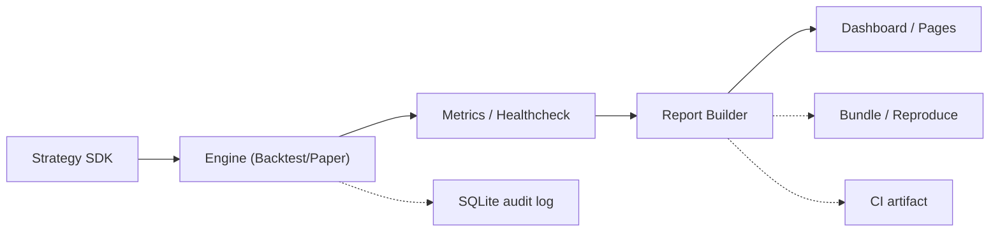
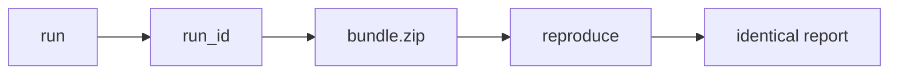

# stratcheck

[](./.github/workflows/ci.yml)
[](./.github/workflows/pages.yml)
[](./LICENSE)

一个可复现的策略体检交付工具链：从回测与稳健性分析，到报告与 dashboard 的静态发布。

## Abstract

Stratcheck is a delivery-oriented quantitative research framework designed to improve trust in strategy evaluation. Traditional research workflows often fail at handoff because results are hard to reproduce, assumptions are under-tested, and execution context is weakly documented. Stratcheck addresses this by combining config-driven runs, walk-forward health checks, cost-sensitivity analysis, execution-quality diagnostics, and run-level audit replay into a unified pipeline. The system produces versionable HTML artifacts (reports, dashboards, and reproducibility bundles) and publishes them as static Pages outputs for low-friction review. In practice, this approach shifts evaluation from single-number backtest performance toward process reliability: whether a strategy remains interpretable, stable, and auditable under realistic assumptions.

[](https://constantine-s-an.github.io/strachech/)
[](https://github.com/Constantine-S-AN/strachech/settings/pages)
[](#quickstart)
[](./docs/START_HERE.md)
[](./docs/case-study.md)
[](./docs/interview.md)

- Walk-forward healthcheck: 按窗口滚动体检，避免只看全样本收益。
- Cost sensitivity: 对手续费/滑点假设做敏感性扫描，检验结论稳健性。
- Execution quality + Audit replay: 关注执行质量指标，并支持 run 级时间线回放。


> Run `make demo-gif` to generate/update this recording.

Pages URL:
- First-time setup (one-time): open [Settings > Pages](https://github.com/Constantine-S-AN/strachech/settings/pages), set **Source = GitHub Actions**, then run [`pages.yml`](./.github/workflows/pages.yml) once.
- [https://constantine-s-an.github.io/strachech/](https://constantine-s-an.github.io/strachech/)
- If the link is temporarily unavailable, open the latest Pages run in [Actions](./.github/workflows/pages.yml).

## Screen 2 · Architecture



<a id="quickstart"></a>

## Screen 3 · Quickstart（5 分钟复现）

```bash
python -m pip install -e ".[dev]"
python scripts/make_demo_assets.py --output data/QQQ.csv --periods 240 --seed 7
python -m stratcheck run --config configs/examples/buy_and_hold.toml
python -m stratcheck dashboard --results-jsonl reports/results.jsonl --db reports/paper_trading.sqlite --output reports/dashboard.html --reports-dir reports
python scripts/build_site.py --root .
```

<details>
<summary>展开查看原 README 细节（已下移）</summary>

### 30-second Overview

- Input: `config.toml` + OHLCV data (`data/<symbol>.csv`)
- Engine: run backtest, walk-forward checks, and execution-quality analysis
- Output: HTML reports, experiment index, dashboard, and reproducible run snapshots
- Delivery: `/site` static pages auto-built in CI and deployed to GitHub Pages

### Live Demo Pages

GitHub Pages:
- Landing: [https://constantine-s-an.github.io/strachech/](https://constantine-s-an.github.io/strachech/)
- Featured report: [https://constantine-s-an.github.io/strachech/report/](https://constantine-s-an.github.io/strachech/report/)
- Dashboard: [https://constantine-s-an.github.io/strachech/dashboard/](https://constantine-s-an.github.io/strachech/dashboard/)

### Repro Flow (Mermaid)



### Core Commands (unchanged)

```bash
python -m stratcheck demo --output reports/demo.html --periods 240 --seed 7
python -m stratcheck run --config configs/examples/buy_and_hold.toml
python -m stratcheck healthcheck --config configs/examples/volatility_target.toml
python -m stratcheck dashboard --results-jsonl reports/results.jsonl --db reports/paper_trading.sqlite --output reports/dashboard.html --reports-dir reports
python -m stratcheck bundle --run-id <RUN_ID>
python -m stratcheck reproduce reports/bundles/<RUN_ID>.zip
```

### Site Build and Deploy

- Local build: `make site` or `python scripts/build_site.py --root .`
- CI deploy: push to `main` triggers GitHub Pages deployment from `/site`
- PRs run test/lint only and do not deploy Pages

### Docs

- [`./docs/index.md`](./docs/index.md)
- [`./docs/quickstart.md`](./docs/quickstart.md)
- [`./docs/showcase.md`](./docs/showcase.md)
- [`./docs/tutorials/qqq-rotation-from-zero.md`](./docs/tutorials/qqq-rotation-from-zero.md)
- [`./docs/tutorials/new-strategy-in-10-min.md`](./docs/tutorials/new-strategy-in-10-min.md)

### Governance

- [`./LICENSE`](./LICENSE)
- [`./CONTRIBUTING.md`](./CONTRIBUTING.md)
- [`./SECURITY.md`](./SECURITY.md)

</details>
