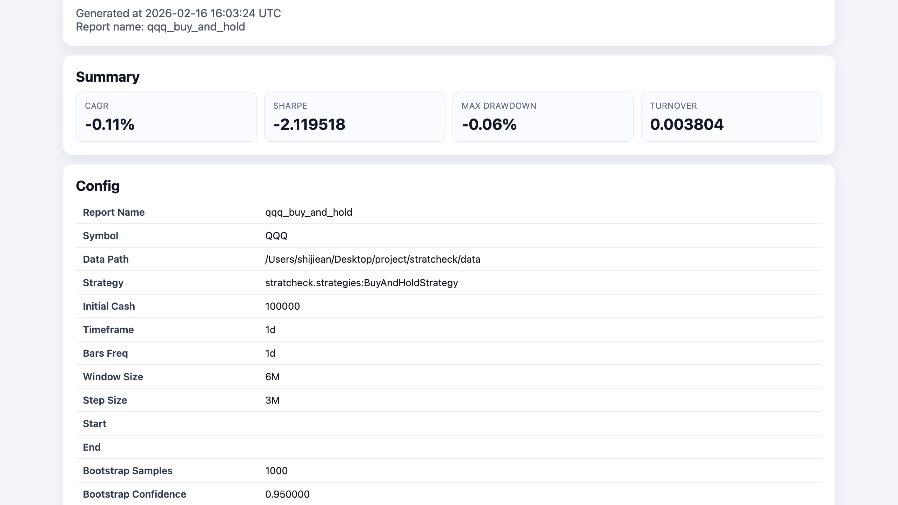

# stratcheck

`stratcheck` 是一个“策略体检报告”工具，支持：

1. 回测（市场单 + 手续费/滑点）
2. 指标计算与图表输出
3. Walk-forward 体检（滚动窗口）
4. HTML 报告与 JSON 汇总输出

## 环境要求

- Python 3.11+

## 安装

开发模式（本地调试）：

```bash
python -m pip install -e ".[dev]"
```

发布模式（PyPI）：

```bash
pip install stratcheck
```

## 5 分钟复现 demo

1) 生成最小示例数据（体积小、可提交）：

```bash
python scripts/make_demo_assets.py --output data/QQQ.csv --periods 90 --seed 7
```

2) 跑一个基线策略并生成报告：

```bash
python -m stratcheck run --config configs/examples/buy_and_hold.toml
```

3) 可选：跑一次 walk-forward 体检：

```bash
python -m stratcheck healthcheck --config configs/examples/volatility_target.toml
```

4) 打开输出：

- `reports/qqq_buy_and_hold.html`
- `reports/qqq_volatility_target.html`
- `reports/healthcheck_summary.json`

### Demo 截图



## 公开 Demo（Release）

公开截图：


复现命令：

```bash
python scripts/make_demo_assets.py --output data/QQQ.csv --periods 240 --seed 7
python -m stratcheck demo --output reports/release_demo.html --periods 240 --seed 7
python -m stratcheck dashboard \
  --results-jsonl reports/results.jsonl \
  --db reports/paper_trading.sqlite \
  --output reports/dashboard.html \
  --reports-dir reports
python scripts/generate_showcase_assets.py --root .
```

## 作品集展示面

如果你要把项目放进作品集，直接用：

- 展示页：`docs/showcase.md`
- 截图目录：`docs/images/showcase/`
- 一键刷新截图：`python scripts/generate_showcase_assets.py --root .`

## 文档

- `docs/index.md`
- `docs/quickstart.md`
- `docs/security-secrets.md`
- `docs/showcase.md`
- `docs/tutorials/qqq-rotation-from-zero.md`
- `docs/tutorials/qqq-low-frequency-rotation-regime-sensitivity.md`
- `docs/tutorials/twap-execution-quality.md`
- `docs/tutorials/new-strategy-in-10-min.md`
- `docs/common-pitfalls.md`
- `docs/release-milestones.md`

## 开源治理文件

- `LICENSE`
- `CONTRIBUTING.md`
- `.github/CODEOWNERS`
- `SECURITY.md`

## 示例项目

- `examples/qqq_rotation/README.md`
- `examples/qqq_rotation/config.toml`

示例项目可以直接复现“QQQ 轮动策略从 0 到报告”。

## CLI 使用

### 1) Demo（随机数据 + 示例策略 + 报告）

```bash
python -m stratcheck demo
```

可选参数：

```bash
python -m stratcheck demo --output reports/custom.html --periods 500 --seed 7
```

默认输出：
- `reports/demo.html`
- `reports/assets/*.png`

### 2) Run（读取 config.toml 跑指定策略）

```bash
python -m stratcheck run --config config.toml
```

输出：
- `reports/<report_name>.html`
- `reports/assets/*.png`
- `reports/runs/<run_id>/`（含 config、data hash、signals/trades、报告快照）

### 3) Healthcheck（滚动窗口体检）

```bash
python -m stratcheck healthcheck --config config.toml
```

输出：
- `reports/<report_name>.html`
- `reports/healthcheck_summary.json`
- `reports/assets/*.png`
- `reports/runs/<run_id>/`（含 config、data hash、signals/trades、报告快照）

### 4) Replay（按 run-id 回放审计时间线）

```bash
python -m stratcheck replay --run-id <RUN_ID> --db reports/paper_trading.sqlite
```

输出：
- 该次 run 的参数、状态、完整时间线（signals / orders / fills / snapshots）

### 5) Dashboard（实验排行 + 报告链接 + paper run 状态）

```bash
python -m stratcheck dashboard \
  --results-jsonl reports/results.jsonl \
  --db reports/paper_trading.sqlite \
  --output reports/dashboard.html \
  --reports-dir reports
```

输出：
- `reports/dashboard.html`（含表格筛选）

### 6) Create Strategy（生成策略插件模板 + 示例配置）

```bash
python -m stratcheck create-strategy MyStrategy
```

默认输出：
- `stratcheck/strategies/my_strategy.py`
- `configs/examples/my_strategy.toml`

可选参数：

```bash
python -m stratcheck create-strategy MyStrategy \
  --strategy-dir stratcheck/strategies \
  --config-dir configs/examples \
  --force
```

### 7) Bundle（导出可复现实验包）

先执行 `run` 或 `healthcheck`，记录输出中的 `Run ID`，再打包：

```bash
python -m stratcheck bundle --run-id <RUN_ID>
```

可选参数：

```bash
python -m stratcheck bundle \
  --run-id <RUN_ID> \
  --runs-dir reports/runs \
  --output reports/bundles/<RUN_ID>.zip
```

### 8) Reproduce（跨机器复现同一报告）

```bash
python -m stratcheck reproduce reports/bundles/<RUN_ID>.zip
```

默认输出目录：
- `reports/reproduced/<run_id>/report.html`

## 运行监控与告警（Paper Runner）

`LivePaperRunner` 已集成运维能力：

- 结构化日志（JSONL）：默认 `reports/paper_runner.jsonl`
- 运行指标：
  - Prometheus 文本：默认 `reports/paper_metrics.prom`
  - CSV：默认 `reports/paper_metrics.csv`
  - 指标包含：`pnl`、`drawdown`、`order_rate`、`error_rate`
- Kill Switch（自动停止并记录原因）：
  - 连续错误阈值
  - 超回撤阈值
  - 数据中断（时间戳缺口）阈值

## Secrets 安全配置

推荐策略：

- 优先用环境变量注入 secrets（不要写进 `config.toml`）
- 本地需要持久化时，使用 `stratcheck.ops.LocalEncryptedSecretStore`（可选）
- CI 中禁止打印 secrets，`JsonEventLogger` 会对敏感字段自动脱敏

最小示例：

```python
from stratcheck.ops import SecretManager

secret_manager = SecretManager(env_prefix="STRATCHECK_")
api_key = secret_manager.get_secret("broker_api_key", required=True)
raw_key = api_key.reveal()
```

完整说明见：`docs/security-secrets.md`

## 策略库（基线对比）

新增 3 个基线策略（可直接在 config 里引用）：

- `stratcheck.strategies:BuyAndHoldStrategy`
- `stratcheck.strategies:VolatilityTargetStrategy`
- `stratcheck.strategies:MeanReversionZScoreStrategy`

示例配置在 `configs/examples/`：

- `configs/examples/buy_and_hold.toml`
- `configs/examples/volatility_target.toml`
- `configs/examples/mean_reversion_zscore.toml`

## 批量实验（ExperimentRunner）

可通过 Python API 批量运行 `configs/*.toml`：

```python
from stratcheck.core import ExperimentRunner

runner = ExperimentRunner(configs_dir="configs", output_dir="reports")
summary_frame, index_path = runner.run_all()
print(index_path)
```

输出：
- `reports/index.html`（实验汇总表，含每个实验报告链接）
- `reports/results.jsonl`（逐实验执行结果与失败原因）
- `reports/<experiment>.html`（单实验报告）

## config.toml 示例

`run` / `healthcheck` 共用一个配置文件，至少包括：
- `symbol`
- `data_path`
- `strategy`（`module:Class`）
- `initial_cash`
- `cost_model`
- `windows`

示例：

```toml
symbol = "BTCUSDT"
data_path = "data"
strategy = "stratcheck.core.strategy:MovingAverageCrossStrategy"
initial_cash = 100000
timeframe = "1d"
bars_freq = "1d"
report_name = "btc_run"
report_dir = "reports"

[cost_model]
type = "fixed_bps" # fixed_bps | spread | market_impact
commission_bps = 5
slippage_bps = 5

[windows]
window_size = "6M"
step_size = "3M"

[performance]
use_parquet_cache = true
# 可选：自定义 parquet 缓存目录
# parquet_cache_dir = "data/cache/parquet"

[strategy_params]
short_window = 20
long_window = 50
target_position_qty = 1.0

[robustness]
bootstrap_samples = 1000
confidence = 0.95

[robustness.parameter_sweep]
metric = "sharpe"

[robustness.parameter_sweep.grid]
short_window = [10, 20, 30]
long_window = [40, 50, 60]

[tuning]
enabled = true
method = "grid" # grid | random
n_iter = 12
drawdown_penalty = 2.0
window_size = "6M"
step_size = "3M"

[tuning.search_space]
short_window = [10, 15, 20]
long_window = [40, 50, 60]
```

### 成本模型配置

`[cost_model]` 支持三种可插拔模型：

1. `type = "fixed_bps"`（默认）
```toml
[cost_model]
type = "fixed_bps"
commission_bps = 5
slippage_bps = 5
```

2. `type = "spread"`（点差模型，可基于 bar 的 `high-low`）
```toml
[cost_model]
type = "spread"
commission_bps = 2
use_bar_range = true
range_multiplier = 0.25
# 或者不用 high-low，直接给固定 spread_bps
# spread_bps = 8
```

3. `type = "market_impact"`（简化冲击模型，成交量占比越高滑点越大）
```toml
[cost_model]
type = "market_impact"
commission_bps = 2
base_slippage_bps = 1
impact_factor = 0.1
```

### 稳健性分析输出

报告会额外输出两类稳健性结果：

- `Bootstrap Sharpe CI`：通过 `bootstrap_sharpe_ci(...)` 估计 Sharpe 置信区间
- `Parameter Sweep`：通过 `parameter_sweep(...)` 生成参数网格扫描结果表（可直接用于热力图）

另外新增 `Risk Flags`（红/黄/绿）：

### 参数搜索（内置防过拟合）

`stratcheck.tuning` 提供：

- `grid` + `random` 两种参数搜索
- walk-forward 目标函数：`最差窗口 Sharpe - 回撤惩罚`
- 输出：最优参数、trial 表、稳健性图（报告中 `Parameter Tuning` 区块）

## 10 分钟写一个新策略并跑出报告

1) 生成策略模板与 config：

```bash
python -m stratcheck create-strategy MyStrategy
```

2) 打开 `stratcheck/strategies/my_strategy.py`，只改 `build_signals(...)` 的买卖规则。

3) 用生成的配置直接运行：

```bash
python -m stratcheck run --config configs/examples/my_strategy.toml
```

4) 查看报告：

- `reports/my_strategy.html`
- `reports/assets/*.png`

完整说明见：`docs/tutorials/new-strategy-in-10-min.md`

- 白噪声相关检查：`returns` 自相关、命中率相对随机基线
- Walk-forward 稳定性：窗口间 Sharpe 方差、最差窗口 Sharpe 阈值

数据文件格式（`data_path/{symbol}.csv`）需包含：
- `timestamp`（或可识别时间索引）
- `open`, `high`, `low`, `close`, `volume`

## 真实数据（Stooq / QQQ）

已新增 `StooqCSVProvider`（`stratcheck.core.data_sources`）：

- 首次拉取：从 Stooq 下载日线 CSV 并缓存到 `data/cache/`
- 后续运行：命中缓存后不重复下载
- 价格调整开关：`adjust_prices=True` 当前**未支持**，会抛出 `NotImplementedError`
  当前返回的是数据源原始价格

示例：

```python
from stratcheck.core.data_sources import StooqCSVProvider

provider = StooqCSVProvider(cache_dir="data/cache", auto_download=True, adjust_prices=False)
bars = provider.get_bars("QQQ", timeframe="1d")
```

## 开发命令

```bash
ruff check .
ruff format --check .
pytest
```

## 性能优化（Parquet / 增量 / 并行）

- 数据层：`CSVDataProvider` 支持 parquet 缓存索引（命中后优先读 parquet）
- 指标层：`compute_metrics(..., incremental_state=..., return_incremental_state=True)` 支持增量更新
- 图表层：`generate_performance_plots(..., incremental_state=..., return_incremental_state=True)` 支持增量更新
- 实验层：`ExperimentRunner(..., parallel=True, max_workers=...)` 支持 `ProcessPoolExecutor` 进程并行

### 100 个配置 benchmark

```bash
python scripts/benchmark_experiments.py --configs 100 --workers 4 --workspace reports/benchmarks/exp100
```

输出：

- `reports/benchmarks/exp100/benchmark_summary.json`

## Docker 运行（可选）

构建并运行 runner（生成实验报告 + paper sqlite）：

```bash
docker compose run --rm runner
```

输出目录：

- `reports/results.jsonl`
- `reports/index.html`
- `reports/paper_trading.sqlite`
- `reports/*.html`（各实验报告）
- `reports/assets/*.png`

生成 dashboard：

```bash
docker compose run --rm dashboard
```

或直接使用 Make：

```bash
make demo
make dashboard
```

输出：

- `reports/dashboard.html`

## 发布构建

本地构建 wheel / sdist：

```bash
python -m pip install -e ".[dev]"
python -m build
```
