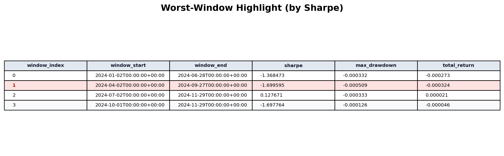

# Stratcheck Case Study

## Problem

Quant research projects often fail in interviews and team handoffs for three reasons:

- Reproducibility gap: results depend on local state and are hard to replay exactly.
- Delivery gap: outputs are scattered in notebooks and logs, not packaged as a shareable demo.
- Audit gap: reviewers cannot inspect a full timeline from signal to report artifact.

## Solution

Stratcheck uses a delivery-first workflow:

- Config-driven execution for consistent runs across local and CI environments.
- Walk-forward `healthcheck` to evaluate stability beyond one full-sample metric.
- Report builder to produce HTML artifacts with metrics, plots, and robustness context.
- Audit replay support (`run_id`, `bundle`, `reproduce`) for traceable investigation.
- GitHub Pages packaging (`site/`) for one-link project review.

## Results

### 1) Summary cards (report overview)


### 2) Worst-window highlight (healthcheck)



### 3) Execution quality snapshot


## How to Reproduce

```bash
python scripts/build_site.py --root .
python -m http.server 8000 --directory site
```

Then open `http://localhost:8000/`.
