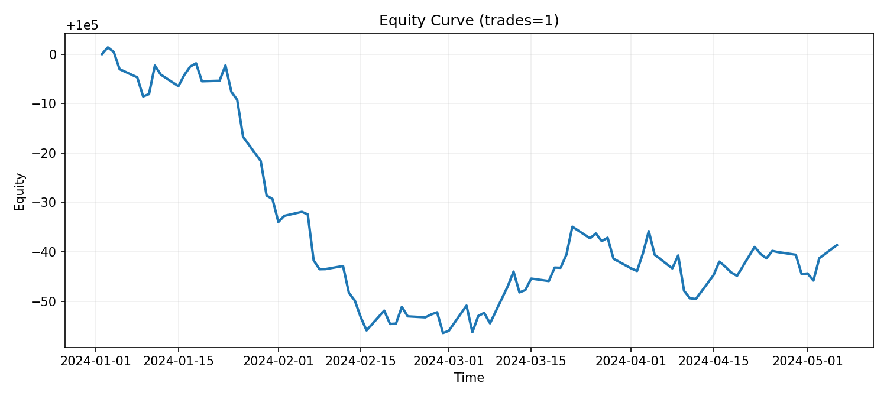
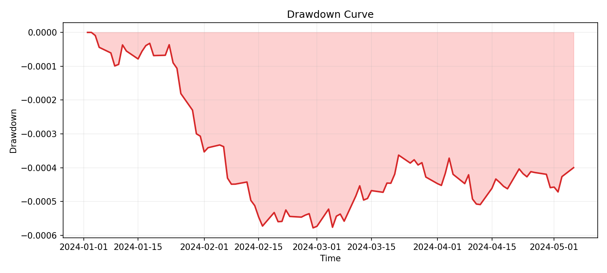
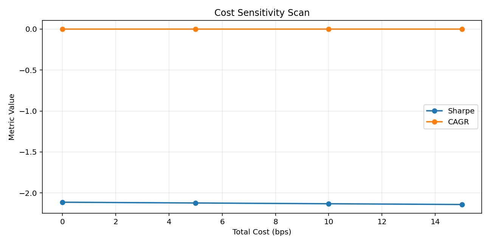
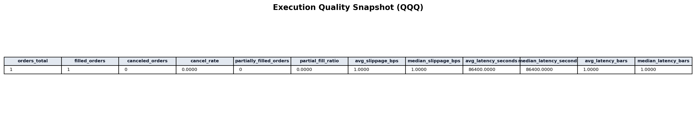
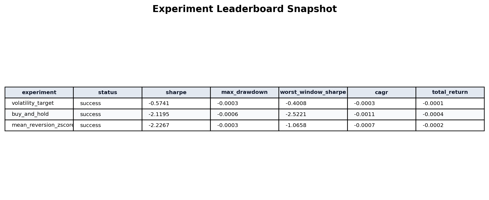
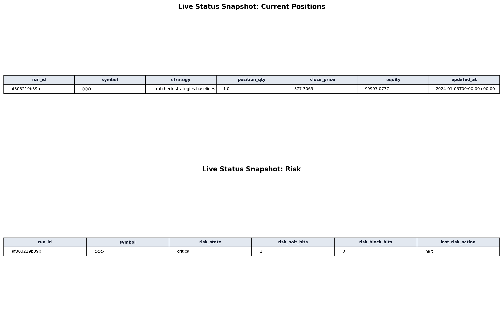

# Project Showcase Guide

本页汇总 `stratcheck` 的公开展示素材，重点呈现可复现研究、执行质量分析、风险治理和运行可视化能力。

## 一句话定位

`stratcheck` 是一个从策略研究、执行质量、风险治理到 dashboard 展示都可复现的量化策略体检工具链。

## Presentation Flow

1. 先展示报告总览，说明你有完整的研究输出
2. 再展示执行质量与风险状态，说明你不仅看收益，还看落地质量
3. 最后展示 leaderboard/live 状态，说明你具备多策略运营视角

## 截图画廊

### 1) 报告总览（完整交付物）


### 2) Equity 曲线（收益轨迹）



### 3) Drawdown 曲线（风险回撤）



### 4) 成本敏感性（假设鲁棒性）



### 5) Execution Quality（执行质量）



### 6) Leaderboard（多实验排序）



### 7) Live Status（仓位与风险）



## Demo Narrative

### Demo A：从数据到报告

- 目标：展示策略研究流程的产品化能力
- 亮点：一条命令生成 HTML 报告 + 图表 + 可复现快照
- 关键输出：`reports/*.html`、`reports/assets/*.png`

### Demo B：执行质量与稳健性

- 目标：展示执行可落地性，而不仅是回测收益
- 亮点：滑点、延迟、撤单率、部分成交占比 + 成本敏感性扫描
- 关键输出：`Execution Quality` 与 `Cost/Slippage Sensitivity` 面板

### Demo C：运营与风控可视化

- 目标：展示“多策略运行 + 风险监控”能力
- 亮点：Leaderboard 排序、Live 持仓、风险状态、最近错误
- 关键输出：`reports/dashboard.html` 和 live 状态快照

## 复现命令

```bash
python -m pip install -e ".[dev]"
python scripts/make_demo_assets.py --output data/QQQ.csv --periods 240 --seed 7
python -m stratcheck demo --output reports/release_demo.html --periods 240 --seed 7
python -m stratcheck run --config configs/examples/buy_and_hold.toml
python -m stratcheck dashboard \
  --results-jsonl reports/results.jsonl \
  --db reports/paper_trading.sqlite \
  --output reports/dashboard.html \
  --reports-dir reports
python scripts/generate_showcase_assets.py --root .
```
